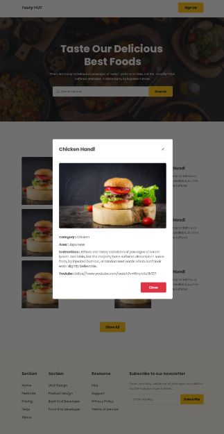

# Tasty Hut

Tasty Hut is a website that displays a list of meals from the MealDB API. Users can search for specific meals by name, and view details about each meal, including its ingredients, instructions, and YouTube video link.
## Screenshots

## Features

* Search for meals by name
* View details about each meal, including ingredients, instructions, and YouTube video link
* Responsive design for optimal viewing on different devices(not yet)

## Technologies Used

* HTML
* CSS
* JavaScript
* MealDB API
* DaisyUI for styling

## How to Run

1. Clone the repository
2. Open the index.html file in a web browser

## Live link

[Live Link](https://phanthom-mekat.github.io/Mealdb-project/)

